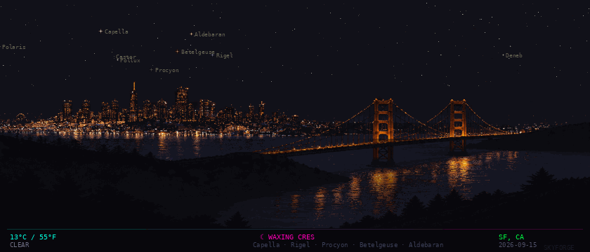

  

  <em>Tonight's sky over San Jose, CA — updated daily by <a href=".github/workflows/skyforge.yml">Skyforge</a></em>

---

### Hey, I'm Hursh Naik

A pixel-art night sky generated fresh every night showing real star positions, moon phase, and live weather for San Jose.

**How it works:** A Python script calculates actual stellar positions using astronomical math, fetches live weather from Open-Meteo, computes the moon phase, and renders it all as an animated pixel-art GIF. Runs on a daily GitHub Actions cron.

---

### Projects

| Project | Description |
|---------|-------------|
| [CircuitHistology](https://github.com/hn6767/CircuitHistology) | Mechanistic interpretability research — dissects how LLMs perform factual reasoning using prompt ablation and attribution graph analysis on Gemma-2-2B |
| [GodelEncoder](https://github.com/hn6767/GodelEncoder) | Neural theorem prover that encodes Metamath/Lean proofs into structured matrices, using spectral analysis and GPT-f style fine-tuning for proof generation |
